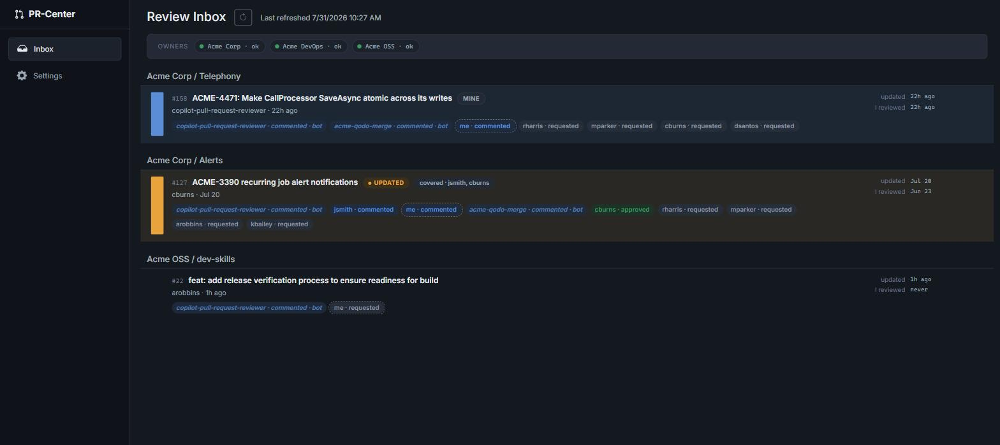
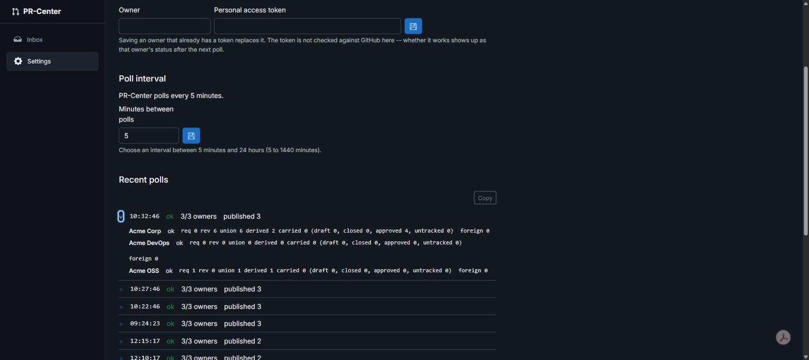
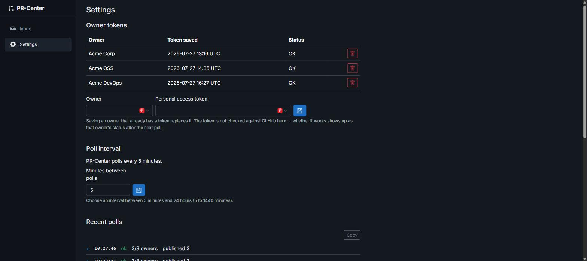
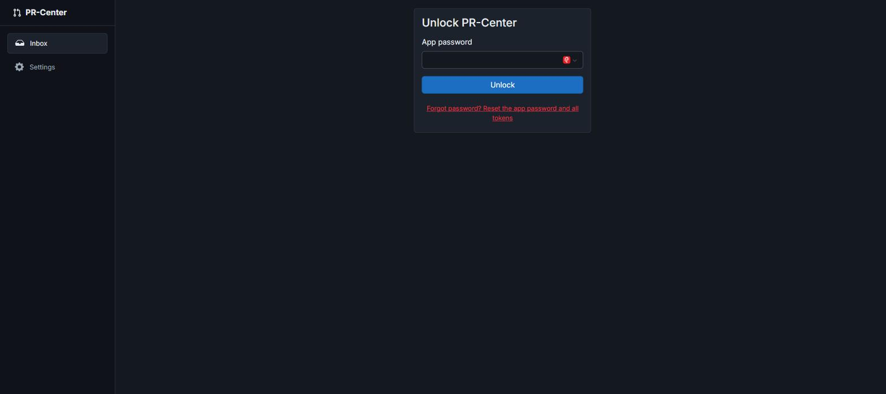
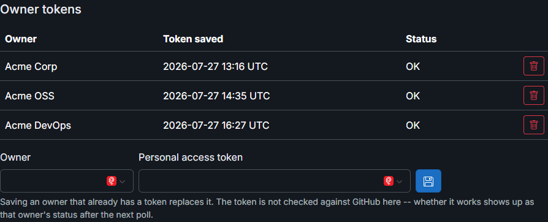

# PR-Center User Guide

PR-Center is a single-user "review inbox" for GitHub pull requests. It answers
the one question your inbox and the GitHub website can't answer at a glance:
**which of my open reviews have new activity since I last looked, and when?**

Screenshots below use fictional org/user names -- the app itself shows your
real GitHub data.

## Why PR-Center

If you review pull requests across more than a couple of repos, orgs, or
accounts, you already know the pain:

- Review requests, follow-up comments, and "changes made" notifications arrive
  scattered across email, Slack, and the GitHub UI.
- Email tells you *something* changed on a PR, not *what* or *whether it still
  needs you*.
- Once you've left a review, you have to keep re-checking the PR yourself to
  see if the author addressed your comments.

PR-Center consolidates every PR waiting on you -- across every configured
GitHub org and your personal account -- into one list, and tracks staleness
**relative to you specifically**: another reviewer approving or commenting
never affects your view. Only your own last review is the baseline for "has
this changed since I looked?"

It is strictly a read/triage surface. All actual review actions (approving,
commenting, requesting changes) still happen on GitHub -- PR-Center never
mutates PR state.

## Screenshots

### Review Inbox

Every PR awaiting your review, grouped by org and repo. The PR title is a link
that opens the PR on GitHub in a new tab -- clicking it doesn't change
anything in PR-Center itself (it's not a "mark as seen" action, see below).

- **Update badge** (the orange dot and "UPDATED" label) -- a new commit,
  comment, or another reviewer's review landed since *you* last reviewed the
  PR. A PR with no badge either hasn't been reviewed by you yet, or has no
  news since your last look.
- **"MINE"** -- a lightweight visual cue for PRs you opened yourself.
- **"I reviewed"** -- the timestamp of your own last review on that PR; "never"
  means you're a requested reviewer but haven't reviewed it yet.
- **Reviewer roster** -- every requested/actual reviewer and their current
  state (approved, commented, requested) inline on the card, including bots
  (shown but excluded from the badge and coverage logic below).
- **"covered · ..."** -- appears once at least one other human has submitted
  any review, so you can see at a glance which PRs already have eyes on them.
  Nothing is hidden or reordered because of this; you still decide.
- **Owners bar** -- per-org/account fetch status (`ok`, error, or
  needs-attention), so a misconfigured token surfaces immediately instead of
  silently returning an empty list.

### Poll diagnostics (Settings)

Every background poll is logged with a per-owner breakdown -- requests made,
PRs reviewed/derived/carried over, and any owner-specific errors -- so a
"why isn't PR X showing up" question is answerable without attaching a
debugger.

### Settings

- **Owner tokens** -- one GitHub personal access token per org/account you
  want PR-Center to watch, entered directly in the app (never in an env var or
  config file).
- **Poll interval** -- how often PR-Center refreshes (5 minutes to 24 hours).

## Getting started

PR-Center ships as a self-contained, xcopy-install app -- no container
runtime, no separate .NET install required.

1. Download the zip for your OS from the
   [latest release](https://github.com/farooq-teqniqly/pr-center/releases/latest):
   - Windows: `PrCenter.Web-<version>-win-x64.zip`
   - macOS: `PrCenter.Web-<version>-osx-x64.zip`
2. Unzip it anywhere on your machine.
3. Run `PrCenter.Web(.exe)`. It listens on `http://localhost:5000` by default
   and binds to localhost only -- it is not reachable from other machines on
   your network.
4. Open `http://localhost:5000` in a browser.

### First run

1. **Set an app password.** PR-Center has no separate login; this password is
   the only gate in front of your decrypted GitHub tokens and is required
   every time the app (re)starts. There's no password recovery -- forgetting
   it means resetting (wiping) stored tokens and re-adding them.

   

2. **Add an owner token** in Settings for each GitHub org or personal account
   you want reviewed PRs from -- a
   [fine-grained personal access token](https://github.com/settings/tokens?type=beta)
   scoped to that owner, with read access to pull requests.

   
3. Go to **Inbox**. PR-Center polls immediately and then on the interval set
   in Settings.

## What PR-Center intentionally doesn't do

- It never approves, comments, or requests changes on your behalf -- all of
  that stays on GitHub.
- It has no "mark as seen" button. The only thing that clears an update badge
  is actually reviewing the PR on GitHub.
- Draft PRs never appear, even if you're a requested reviewer.
