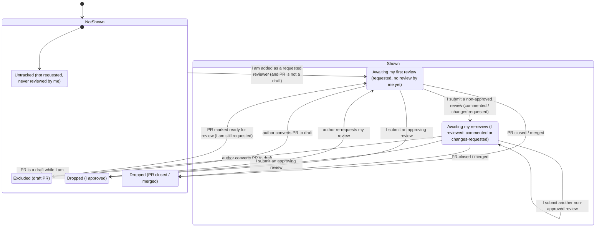
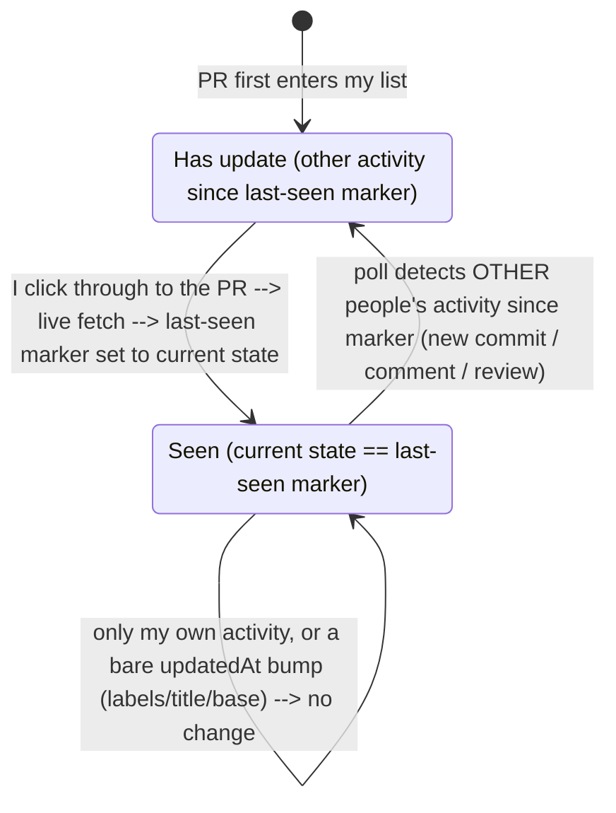
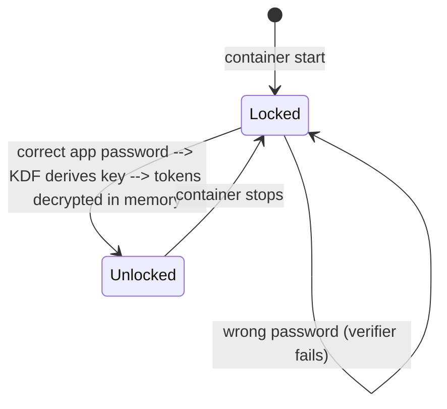

# PR-Center State Model

PR-Center is a read-only projection of GitHub state — it never mutates a PR. This doc makes the state machines it observes and derives explicit, so the list logic ("does this PR show, is it flagged updated, is it already covered") has one authoritative reference. It complements [pr-center-idea.md](./pr-center-idea.md); where they disagree, the Key Decisions in that doc win and this doc should be corrected.

There are three machines:

1. **Membership** — whether a PR appears in my list at all, and why.
2. **Seen/Updated** — for a shown PR, whether it has changed since I last looked. Orthogonal to membership.
3. **App lock** — whether the app is unlocked (tokens decrypted, polling active).

---

## 1. Membership lifecycle

Whether a PR is in my list. All transitions are evaluated **relative to me** — another reviewer's actions never move a PR between these states.

Notes:
- **Shown = { AwaitingFirstReview, AwaitingReReview }.** These are the only states that appear in the list.
- **Membership is derived, not remembered.** Each poll recomputes a PR's state as a pure function of current GitHub facts (am I a requested reviewer? do I have a prior non-approved review on this PR? is it a draft/closed?). There is no stored transition history. This is why the diagram's arrows are illustrative: the app never "remembers" it was in a state — it just recomputes. Consequently a draft marked ready lands in `AwaitingReReview` iff I already have a non-approved review on it, else `AwaitingFirstReview`, with no special-casing.
- **Draft** is a hidden state, not a removal — the PR reappears (with its state recomputed as above) when marked ready.
- **Approved** and **Closed** are terminal for the current review round. Approved can be re-entered into the list only by an author re-request. Closed is terminal unless GitHub reopens the PR.
- **No app-side staleness expiry:** a PR in `AwaitingReReview` stays there indefinitely while open; only my approval or a GitHub close removes it.

---

## 2. Seen / Updated (per shown PR)

Orthogonal to membership: for any PR currently in `Shown`, has it changed since I last looked? This is the "update indicator."

Notes:
- A PR enters the list **Unseen** (I have not looked at it in-app yet).
- "Update" = another person's new commit/push, new comment/reply, or new review — compared against the stored last-seen marker. **My own activity and bare `updatedAt` bumps do not count.** **Bot/CI comments and reviews do not count either** (a qodo or Copilot comment is noise, not a reason to re-look); **bot commits DO count** — a new commit is a real diff to review regardless of who authored it. Bot = the actor's type per the GitHub API (`user.type`/`__typename` == `Bot`), never login-text sniffing (see the 2026-07-10 GitHub adapter spike).
- **Click-through does a fresh live fetch** before setting the marker, so I never clear an update that landed between the last poll and my click.
- **The last-seen marker persists in the DB keyed by PR id and is never proactively deleted.** When a PR leaves the list (approved/closed/draft) the marker row stays; if the PR re-enters, its existing marker applies so it isn't falsely flagged as a fresh update. No cleanup/GC of old markers in v1 (simplest — the table just grows slowly; a single user's PR volume makes this a non-issue).

### "Already covered" — a derived flag, not a state
Independent of Seen/Updated: a PR is flagged **already covered** when ≥1 *other* **human** reviewer has submitted any non-dismissed review (approved / changes-requested / commented). Pending (requested, no review) does not count, **and bot/CI reviews (qodo, Copilot, etc.) do not count** — a bot review is not human coverage. This is a display decoration that signals low marginal value; it never hides or moves the PR. (Decided 2026-07-10, resolving the former open question here; verified against real payloads in the GitHub adapter spike — e.g. a PR whose only human review was dismissed correctly derives as not covered.)

---

## 3. App lock

Gates decryption of the stored tokens and therefore all GitHub access, including background polling.

Notes:
- **No polling or data while Locked** — the key is required to call GitHub. After a restart, the list is empty until I unlock.
- **No auto-lock / idle timeout in v1** — once unlocked, stays unlocked until the container stops. The decrypted key lives server-side in the Blazor process, shared across browser tabs.
- **Forgotten password has no recovery** — reset wipes stored tokens; I re-enter all three PATs.
